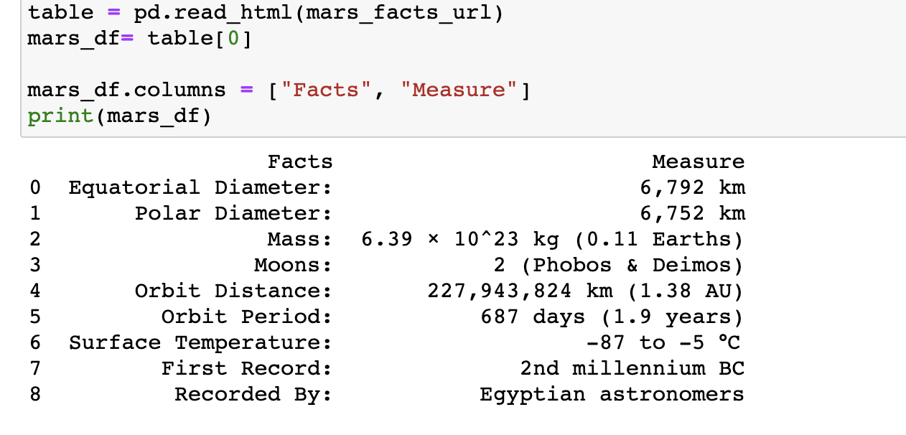

# Web Scraping Homework - Mission to Mars
:rocket: :rocket: :rocket: :rocket: :rocket: :rocket:


For the Web Scraping Homeworking I built a web application that scrapes websites for data associated 
with to **Mission to Mars** which displays the information in a single HTML page. This outline descibes what I did. 

## Step 1 - Scraping

Complete initial scraping using Jupyter Notebook, BeautifulSoup, Pandas, and Requests/Splinter.

* Jupyter Notebook file called `mission_to_mars.ipynb` to complete all scraping and analysis tasks. The following outlines what was scraped.

### NASA Mars News

* Scraped [NASA Mars News Site](https://mars.nasa.gov/news/) collected latest News Title and Paragraph Text. Assign the text to variables that you can reference later.


### JPL Mars Space Images - Featured Image

* Scraped the JPL Featured Space Image [here](https://www.jpl.nasa.gov/spaceimages/?search=&category=Mars).

* Used splinter to navigate the site and find the image url for the current Featured Mars Image and assign the url string to a variable called `featured_image_url`.

*featured_img = soup.find("footer")*

*featured_img = featured_img.find("a")["data-fancybox-href"]*


### Mars Facts ### 

* Scraped the Mars Facts webpage [here](https://space-facts.com/mars/) and used Pandas to scrape the table containing facts about the planet including Diameter, Mass, etc. Use Pandas to convert the data to a HTML table string.
I built a mars Dataframe for quick reference.



### Mars Hemispheres

* Visit the USGS Astrogeology site [here](https://astrogeology.usgs.gov/search/results?q=hemisphere+enhanced&k1=target&v1=Mars) to obtain high resolution images for each of Mar's hemispheres.

* You will need to click each of the links to the hemispheres in order to find the image url to the full resolution image.

* Save both the image url string for the full resolution hemisphere image, and the Hemisphere title containing the hemisphere name. Use a Python dictionary to store the data using the keys `img_url` and `title`.

* Append the dictionary with the image url string and the hemisphere title to a list. This list will contain one dictionary for each hemisphere.

```python
# Example:
hemisphere_image_urls = [
    {"title": "Valles Marineris Hemisphere", "img_url": "..."},
    {"title": "Cerberus Hemisphere", "img_url": "..."},
    {"title": "Schiaparelli Hemisphere", "img_url": "..."},
    {"title": "Syrtis Major Hemisphere", "img_url": "..."},
]
```

- - -

## Step 2 - MongoDB and Flask Application

Use MongoDB with Flask templating to create a new HTML page that displays all of the information that was scraped from the URLs above.

* Start by converting your Jupyter notebook into a Python script called `scrape_mars.py` with a function called `scrape` that will execute all of your scraping code from above and return one Python dictionary containing all of the scraped data.

* Next, create a route called `/scrape` that will import your `scrape_mars.py` script and call your `scrape` function.

  * Store the return value in Mongo as a Python dictionary.

* Create a root route `/` that will query your Mongo database and pass the mars data into an HTML template to display the data.

* Create a template HTML file called `index.html` that will take the mars data dictionary and display all of the data in the appropriate HTML elements. Make sure your template will display a page even if the data is empty. Use the following as a guide for what the final product should look like, but feel free to create your own design. 


- - -

## Step 3 - Submission

To submit your work to BootCampSpot, create a new GitHub repository and upload the following:

1. The Jupyter Notebook containing the scraping code used.

2. Screenshots of your final application.

3. Submit the link to your new repository to BootCampSpot.

4. Ensure your repository has regular commits (i.e. 20+ commits) and a thorough README.md file

## Hints

* Use Splinter to navigate the sites when needed and BeautifulSoup to help find and parse out the necessary data.

* Use Pymongo for CRUD applications for your database. For this homework, you can simply overwrite the existing document each time the `/scrape` url is visited and new data is obtained.

* Use Bootstrap to structure your HTML template.

### Copyright

Amoroso © 2020. All Rights Reserved.